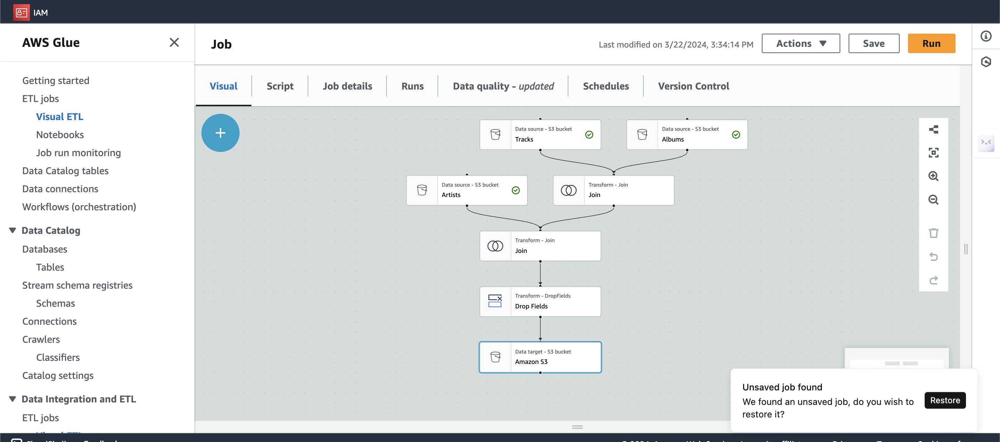

# AWS-DataEngineering
Doing an ETL on Spotify's 2023 Music data using Kafka and publishing on AWS also Leveraging services like S3, Athena, Glue, EC2 
## Project Architecture

## Project's Amazon Web Services Screens

# S3 Buckets

# EC2

# Glue

# Athena

# Crwalers

